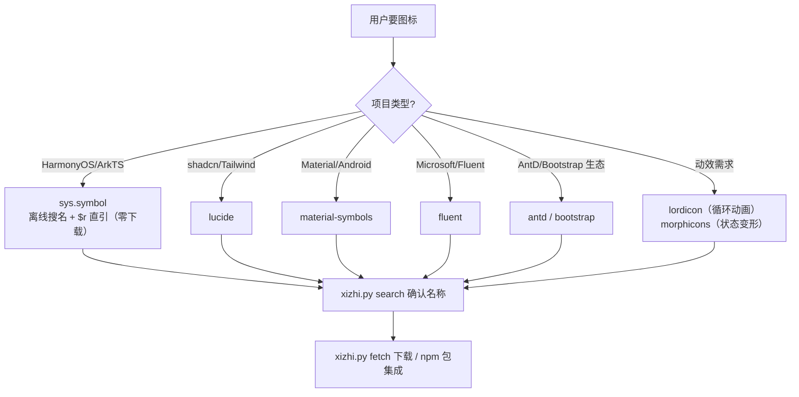

# Xizhi — 官方图标套件选型与自动下载技能

[](https://github.com/Kirky-X/xizhi/releases) [](LICENSE) [](#-支持套件一览)

> 面向 AI agent 的图标资产技能：按项目上下文**确定性选型**官方图标套件 → **离线/在线搜名防幻觉** → **脚本化自动下载**。21 个套件直连（许可逐个核验）+ Iconify 20 万聚合兜底；鸿蒙 sys.symbol 零下载直引，Web 套件 jsDelivr/GitHub 双通道。

中文 | [English](README_EN.md)

## ✨ 功能特性

- **21 套件确定性选型表**（许可逐个核验，含 2026 许可变更追踪：RemixIcon 新许可商用 ✓、css.gg 新许可已排除）：HarmonyOS→`sys.symbol`、shadcn/Tailwind→lucide、Material→Material Symbols、Microsoft→Fluent、动效→lordicon/morphicons……查表路由，不让模型自由发挥（规则5：确定性逻辑禁止交给模型）
- **名称防幻觉**：lucide 名称+tag 双索引（自动命中 `home`→`house` 更名）；**鸿蒙双源索引**——官方目录 579 图标（含中文名/unicode，搜"设置"→`gearshape`）+ 离线 SDK 全量清单 2761 名称，无网可用
- **脚本化自动下载**：一个 CLI 覆盖全部套件，jsDelivr / raw.githubusercontent 双通道，2026-09 全量实测 200；变体参数自动进文件名防覆盖
- **鸿蒙全通路**：代码内 `SymbolGlyph($r('sys.symbol.*'))` 零下载直引；SVG 需求走逆向出的官方通道——`name_map_new.json` 目录 + `HMSymbol.ttf` 可变字体（wght 40-900，4837 字形），fontTools 渲染与官网前端 fontkit 同管线
- **动效图标方案**：lordicon（Lottie JSON 直下 CDN）+ morphicons（弹簧物理变形动画库，吃 stroke 型图标）
- **零 pip 依赖**：纯 Python 标准库（urllib），跨平台；名称索引 7 天本地缓存，`--refresh` 强制刷新
- **失败显性化**：非法变体/404/通道失效/HTML 软 200 全部显式报错 exit 1，绝不静默



## 📦 支持套件一览

| set | 套件 | 许可 | 定位 |
| --- | ---- | ---- | ---- |
| `harmonyos` | HarmonyOS Symbol | 随系统分发 | 鸿蒙首选；代码内零下载；SVG/字体可脚本化下载（官方目录含中文名） |
| `lucide` | Lucide | ISC | Web 默认首选，1834 图标，shadcn/ui 默认 |
| `remix` | Remix Icon | Remix Icon License v1.0 | 3200+，商用 ✓ 署名可选（2026-01 新许可，禁单独售卖） |
| `mdi` | Material Design Icons (Pictogrammers) | Pictogrammers Free License | 社区单体最大 7400+，Apache-2.0 基底 |
| `ionicons` | Ionicons (Ionic) | MIT | Ionic 官方，移动端气质 |
| `octicons` | Octicons (GitHub) | MIT | GitHub 官方，开发者工具风 |
| `radix` | Radix Icons | MIT | Radix UI 官方，极简精选 |
| `eva` | Eva Icons (Akveo) | MIT | 圆润柔和，outline/fill |
| `iconoir` | Iconoir | MIT | 新生代线性集 1500+ |
| `simple-icons` | Simple Icons | CC0-1.0 | 品牌/技术栈 logo（商标法另计） |
| `iconify` | Iconify 聚合 | 按来源套件 | 200k+/150+ 套件兜底，含国旗/技术栈/emoji |
| `material-symbols` | Material Symbols (Google) | Apache-2.0 | Material/Android 官方，可变字体四轴 |
| `fluent` | Fluent UI System Icons (Microsoft) | MIT | 微软官方，名称自带尺寸风格后缀 |
| `heroicons` | Heroicons (Tailwind Labs) | MIT | Tailwind 生态（非 shadcn 项目） |
| `antd` | Ant Design Icons | MIT | AntD/蚂蚁系中后台 |
| `bootstrap` | Bootstrap Icons | MIT | Bootstrap 生态 |
| `phosphor` | Phosphor | MIT | 6 字重/双色调排版体系 |
| `tabler` | Tabler Icons | MIT | 5000+ 量大管饱 |
| `lordicon` | Lordicon | 官网条款 | Lottie 动效图标（免费+付费） |
| `morphicons` | Morphicons | MIT | 图标变形动画库（非图标集） |
| `feather` | Feather Icons | MIT | 遗留项目兼容（停更） |

## 🚀 快速开始

```bash
# 1. 选型速览 / 套件通道详情
python3 {SKILL_DIR}/scripts/xizhi.py sets
python3 {SKILL_DIR}/scripts/xizhi.py describe --set material-symbols

# 2. 搜名（写码前必做，防幻觉；harmonyos 官方目录支持中文名，离线降级 SDK 清单）
python3 {SKILL_DIR}/scripts/xizhi.py search --set lucide --query home        # tag 命中已更名的 house
python3 {SKILL_DIR}/scripts/xizhi.py search --set harmonyos --query 铃铛     # 官方目录：bell · unicode F01D5

# 3. 下载（变体可选，自动进文件名）
python3 {SKILL_DIR}/scripts/xizhi.py fetch --set lucide --name house --out ./assets/icons
python3 {SKILL_DIR}/scripts/xizhi.py fetch --set material-symbols --name home --style outlined --size 48 --fill _fill1
python3 {SKILL_DIR}/scripts/xizhi.py fetch --set lordicon --name lupuorrc    # Lottie JSON
python3 {SKILL_DIR}/scripts/xizhi.py fetch --set harmonyos --name house --wght 700 --out ./assets/icons  # 官方字体渲染 SVG
python3 {SKILL_DIR}/scripts/xizhi.py fetch --set iconify --name icon-park-outline:home --out ./assets/icons # 聚合兜底
```

鸿蒙代码内直接引用（无需任何下载）：

```typescript
SymbolGlyph($r('sys.symbol.house')).fontSize(24).fontColor('#333')
```

## 🧪 测试与验证

数据均为 2026-09-14 真实网络实测（规则32：禁止编造）：

- 21 套件 × fetch 全量回归：全部下载/生成成功 ✓（含 harmonyos SVG 生成、字体直下与 iconify 聚合）
- search 全套件：精确名/tag/前缀/包含四级排序 ✓（lucide `home`→`house`、fluent `home_24_regular`、bootstrap `house-door`、harmonyos 中文 `设置`→`gearshape`）
- 错误路径：非法变体 / 404 / 无匹配显性 exit 1 ✓
- 鸿蒙通道逆向实测：官网 SPA（`hm-symbol.js`）→ 数据文件 `name_map_new.json`（579 图标）+ `HMSymbol.ttf`（4837 字形，579/579 unicode 命中；覆盖 SDK 清单 2746/2761）；SVG 由 fontTools 从字体提取字形（与官网前端 fontkit 同管线）
- 防幻觉有效性：`gear`/`settings` 不在鸿蒙清单（正确名 `gearshape`）；SDK 清单提取自 [webabcd/HarmonyDemo IconDemo.ets](https://github.com/webabcd/HarmonyDemo/blob/main/entry/src/main/ets/pages/resource/IconDemo.ets)

```bash
# 回归脚本（在有网环境）
python3 scripts/xizhi.py sets && python3 scripts/xizhi.py search --set harmonyos --query house
python3 scripts/xizhi.py fetch --set lucide --name house --out /tmp/icons
```

## 📁 目录结构

```
xizhi/
├── SKILL.md                       # 触发入口：选型表 + 三步工作流
├── scripts/xizhi.py               # 统一 CLI（sets/search/fetch/describe）
├── data/harmonyos-symbols.txt     # 2761 个 sys.symbol 离线名称清单
└── references/
    ├── lucide.md                  # lucide 集成/命名更名史/CDN
    ├── harmonyos-symbol.md        # SymbolGlyph 用法与找名三通道
    ├── lordicon.md                # 动效图标：player/trigger/id 获取
    ├── morphicons.md              # 变形动画：框架入口/stroke 约束
    └── official-web.md            # Material/Fluent/Heroicons/Tabler/Phosphor/Bootstrap/AntD/feather
```

## 📜 License

[MIT](LICENSE) © 2026 Kirky-X🌠
