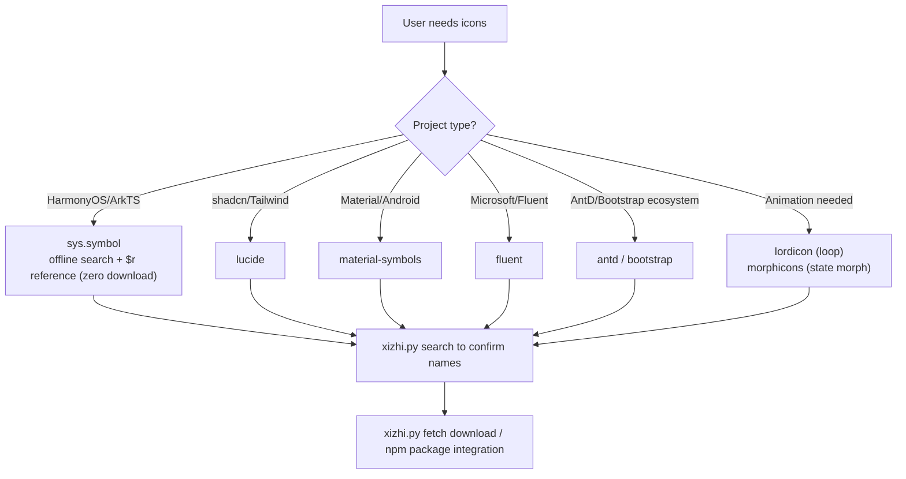

# Xizhi — Official Icon Set Routing & Auto-Download Skill

[](https://github.com/Kirky-X/xizhi/releases) [](LICENSE) [](#-supported-sets)

> Icon asset skill for AI agents: deterministically pick the right official icon set by project context → anti-hallucination name search (offline/online) → scripted auto-download. 21 first-class sets (licenses individually verified) plus Iconify 200k aggregate fallback; HarmonyOS sys.symbol referenced in code with zero downloads; web sets via dual jsDelivr/GitHub channels.

English | [中文](README.md)

## ✨ Features

- **Deterministic 21-set routing table** (licenses individually verified, tracking 2026 changes: RemixIcon new license commercial-OK, css.gg new license excluded): HarmonyOS→`sys.symbol`, shadcn/Tailwind→lucide, Material→Material Symbols, Microsoft→Fluent, animated→lordicon/morphicons… table-driven routing, no free-styling (deterministic logic stays in lookup tables, not the model)
- **Anti-hallucination name search**: lucide dual name+tag index (resolves renames like `home`→`house`); **HarmonyOS dual-source index** — official catalog of 579 icons (with Chinese names/unicode) + offline SDK full list of 2,761 names, works without network
- **Scripted auto-download**: one CLI for all sets, dual jsDelivr / raw.githubusercontent channels, all verified 200 on 2026-09; variant flags are appended to filenames to prevent overwrites
- **HarmonyOS full pipeline**: in-code `SymbolGlyph($r('sys.symbol.*'))` with zero downloads; SVG needs served by the reverse-engineered official channel — `name_map_new.json` catalog + `HMSymbol.ttf` variable font (wght 40-900, 4,837 glyphs), rendered via fontTools with the same pipeline as the website's frontend fontkit
- **Animated icon options**: lordicon (Lottie JSON via CDN) + morphicons (spring-physics morphing library for stroke icons)
- **Zero pip dependencies**: pure Python stdlib (urllib), cross-platform; 7-day local cache for name indexes, `--refresh` to force
- **Explicit failures**: invalid variants / 404 / broken channels / HTML soft-200 all error out with exit 1 — never silent



## 📦 Supported Sets

| set | Library | License | Positioning |
| --- | ------- | ------- | ----------- |
| `harmonyos` | HarmonyOS Symbol | Bundled with OS | HarmonyOS first choice; zero-download in-code refs; SVG/font scriptable (official catalog with Chinese names) |
| `lucide` | Lucide | ISC | Web default; 1,834 icons; shadcn/ui default |
| `remix` | Remix Icon | Remix Icon License v1.0 | 3,200+; commercial ✓ attribution optional (2026-01 new license) |
| `mdi` | Material Design Icons (Pictogrammers) | Pictogrammers Free License | Largest single community set, 7,400+ |
| `ionicons` | Ionicons (Ionic) | MIT | Ionic official, mobile feel |
| `octicons` | Octicons (GitHub) | MIT | GitHub official, dev-tool style |
| `radix` | Radix Icons | MIT | Radix UI official, minimal curation |
| `eva` | Eva Icons (Akveo) | MIT | Soft rounded, outline/fill |
| `iconoir` | Iconoir | MIT | New-gen linear set, 1,500+ |
| `simple-icons` | Simple Icons | CC0-1.0 | Brand/tech logos (trademarks still apply) |
| `iconify` | Iconify aggregate | Per source set | 200k+ / 150+ sets fallback incl. flags/dev/emoji |
| `material-symbols` | Material Symbols (Google) | Apache-2.0 | Material/Android official; variable-font 4 axes |
| `fluent` | Fluent UI System Icons (Microsoft) | MIT | Microsoft official; size/style suffixes in names |
| `heroicons` | Heroicons (Tailwind Labs) | MIT | Tailwind ecosystem (non-shadcn projects) |
| `antd` | Ant Design Icons | MIT | AntD / Ant ecosystem admin UIs |
| `bootstrap` | Bootstrap Icons | MIT | Bootstrap ecosystem |
| `phosphor` | Phosphor | MIT | 6 weights / duotone typographic system |
| `tabler` | Tabler Icons | MIT | 5,000+ icons, breadth play |
| `lordicon` | Lordicon | Site terms | Lottie animated icons (free + premium) |
| `morphicons` | Morphicons | MIT | Icon morphing animation library (not an icon set) |
| `feather` | Feather Icons | MIT | Legacy compatibility (unmaintained) |

## 🚀 Quick Start

```bash
# 1. Set overview / channel details
python3 {SKILL_DIR}/scripts/xizhi.py sets
python3 {SKILL_DIR}/scripts/xizhi.py describe --set material-symbols

# 2. Search names (mandatory before coding; harmonyos official catalog supports Chinese, offline falls back to SDK list)
python3 {SKILL_DIR}/scripts/xizhi.py search --set lucide --query home        # tag hits renamed house
python3 {SKILL_DIR}/scripts/xizhi.py search --set harmonyos --query bell     # official: bell · unicode F01D5

# 3. Download (optional variants, auto-appended to filename)
python3 {SKILL_DIR}/scripts/xizhi.py fetch --set lucide --name house --out ./assets/icons
python3 {SKILL_DIR}/scripts/xizhi.py fetch --set material-symbols --name home --style outlined --size 48 --fill _fill1
python3 {SKILL_DIR}/scripts/xizhi.py fetch --set lordicon --name lupuorrc    # Lottie JSON
python3 {SKILL_DIR}/scripts/xizhi.py fetch --set harmonyos --name house --wght 700 --out ./assets/icons  # official font rendered SVG
python3 {SKILL_DIR}/scripts/xizhi.py fetch --set iconify --name icon-park-outline:home --out ./assets/icons # aggregate fallback
```

HarmonyOS code references system built-ins directly (no download needed):

```typescript
SymbolGlyph($r('sys.symbol.house')).fontSize(24).fontColor('#333')
```

## 🧪 Tests & Verification

All data verified via real network tests on 2026-09-14:

- Full fetch regression across sets: all downloads/generations succeed ✓ (including harmonyos SVG generation, font download, and iconify aggregate)
- Search across all sets: exact/tag/prefix/contains four-tier ranking ✓ (lucide `home`→`house`, fluent `home_24_regular`, bootstrap `house-door`, harmonyos Chinese 设置→`gearshape`)
- Error paths: invalid variant / 404 / no match all exit 1 explicitly ✓
- HarmonyOS channel reverse-engineered and verified: website SPA (`hm-symbol.js`) → data files `name_map_new.json` (579 icons) + `HMSymbol.ttf` (4,837 glyphs, 579/579 unicode hits; covers 2,746/2,761 of the SDK list); SVG rendered by fontTools from the font (same pipeline as the site's frontend fontkit)
- Anti-hallucination effectiveness: `gear`/`settings` absent from the HarmonyOS list (correct name `gearshape`); SDK list extracted from [webabcd/HarmonyDemo IconDemo.ets](https://github.com/webabcd/HarmonyDemo/blob/main/entry/src/main/ets/pages/resource/IconDemo.ets)

```bash
# Regression (networked environment)
python3 scripts/xizhi.py sets && python3 scripts/xizhi.py search --set harmonyos --query house
python3 scripts/xizhi.py fetch --set lucide --name house --out /tmp/icons
```

## 📁 Layout

```
xizhi/
├── SKILL.md                       # Entry: routing table + 3-step workflow
├── scripts/xizhi.py               # Unified CLI (sets/search/fetch/describe)
├── data/harmonyos-symbols.txt     # Offline list of 2,761 sys.symbol names
└── references/
    ├── lucide.md                  # Integration, rename history, CDN
    ├── harmonyos-symbol.md        # SymbolGlyph usage & 3 name-lookup channels
    ├── lordicon.md                # Animated icons: player/trigger/id workflow
    ├── morphicons.md              # Morph animation: framework entries/stroke constraint
    └── official-web.md            # Material/Fluent/Heroicons/Tabler/Phosphor/Bootstrap/AntD/feather
```

## 📜 License

[MIT](LICENSE) © 2026 Kirky-X🌠
